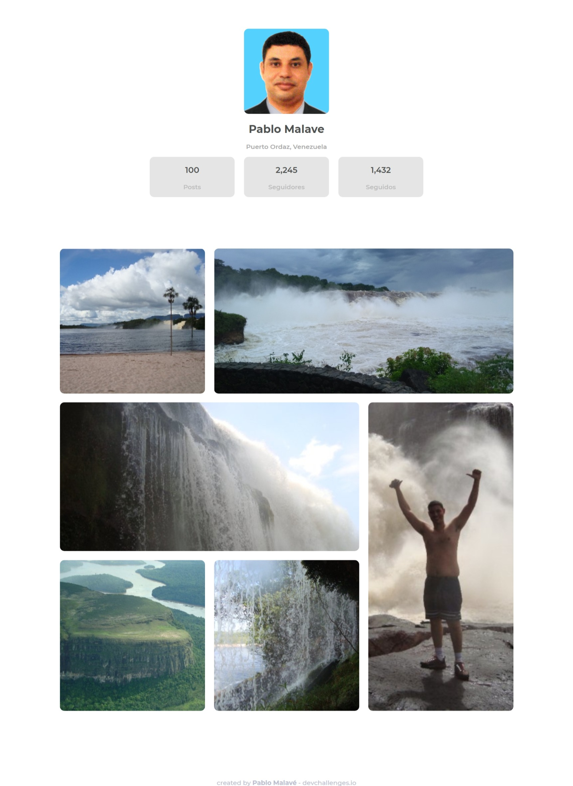
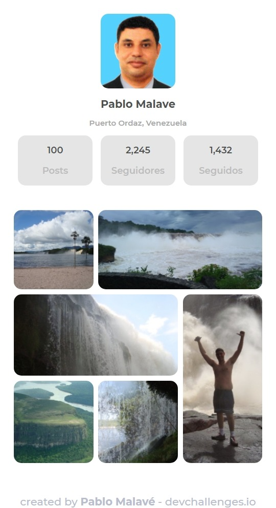
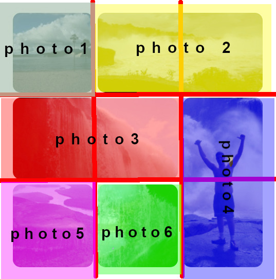
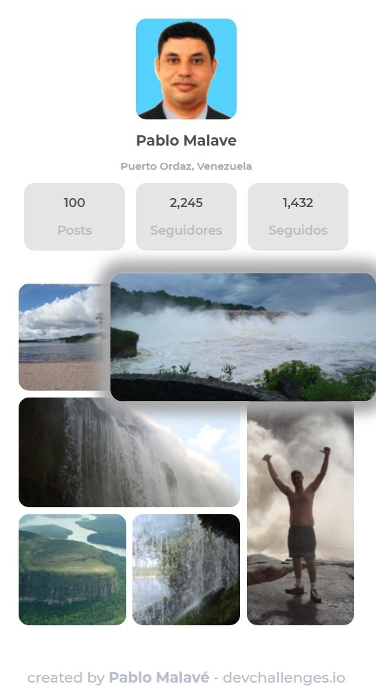

<h1 align="center">Canaima Park - Gallery</h1>
<h3 align="center">My Gallery Challenge</h3>

   Solution for a challenge from  <a href="http://devchallenges.io" target="_blank">Devchallenges.io</a>.

  <h3>
    <a href="https://05-my-gallery.vercel.app/">
      Demo
    </a>
     | 
    <a href="https://github.com/pablomalave/05.my-gallery.git">
      Solution
    </a>
     | 
    <a href="https://devchallenges.io/challenges/gcbWLxG6wdennelX7b8I">
      Challenge
    </a>
  </h3>

<!-- TABLE OF CONTENTS -->

## Table of Contents

- [Overview](#overview)
  - [Built With](#built-with)
- [Features](#features)
- [Contact](#contact)
- [Acknowledgements](#acknowledgements)

<!-- OVERVIEW -->

## Overview

This is a web page of a user profile of a social network similar to Instagram.

It was made using a combination of Flexbox and Grid.

The gallery was set using 3x3 Grid. To distribute the photos, there was use Grid Areas. An area for each photo.

### Built With

<!-- This section should list any major frameworks that you built your project using. Here are a few examples.-->

- HTML, CSS.
- CSS Flexbox.
- CSS Grid.
- Mobile first design.

## Features

<!-- List the features of your application or follow the template. Don't share the figma file here :) -->

This application/site was created as a submission to a [DevChallenges](https://devchallenges.io/challenges) challenge. The [challenge](https://devchallenges.io/challenges/gcbWLxG6wdennelX7b8I) was to build an application to complete the given user stories.
- [x] User story: I can see a page following the given design.
- [x] User story: I can see any photo highlighted in hover state.

## Acknowledgements

- Chris Coyer. [A Complete Guide to Flexbox. ](https://css-tricks.com/snippets/css/a-guide-to-flexbox/) 2013 - 2021.
- Chris Coyer. [A Complete Guide to Grid. ](https://css-tricks.com/snippets/css/complete-guide-grid/) 2013 - 2021.
- Juan Diego Gauchat. [El gran libro de HTML5, CSS3 y Javascript](#) 2013. Marcombo - Ediciones Técnicas.
- Thu Nghiem [Steps to replicate a design with only HTML and CSS.](https://devchallenges-blogs.web.app/how-to-replicate-design/) 2020.

## Contact

- Website [Pablo Malave - GithubPages](https://pablomalave.github.io/CV/)
- GitHub [@pablomalave](https://github.com/pablomalave)